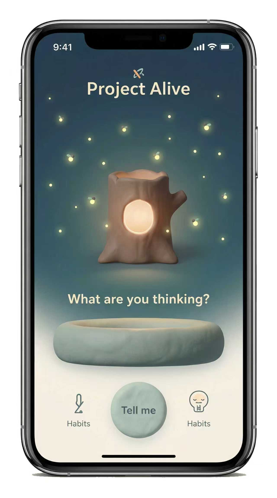
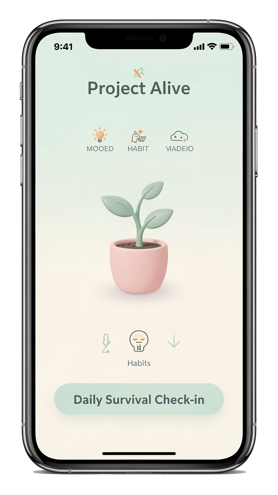

# Project "Alive"

> “在内卷中找到‘活着’的低门槛意义”

  
  

**Alive** 是一款专为处于“情绪亚健康”和“隐性焦虑”的大学生及研究人员设计的心理支持软件。不同于传统的医疗问诊类 App，Alive 侧重于情绪共鸣、社交陪伴和轻量化的心理救赎。它旨在打造一个“当代大学生精神自救互助社群”。

## ✨ 核心功能 (Core Features)

- **每日生存确认 (Daily Survival Confirmation)**
  - 一个低门槛的“打卡”系统。用户只需确认“今天我活着”，作为当日的指标，缓解焦虑，提供当日的“记忆点存储”。

- **生命可视化 / 情绪植被 (Emotional Vegetation)**
  - 将“生存确认”具象化。用户每确认一次“活着”，虚拟界面中的植物或宠物获得一次成长。
  - **设计原则**：只提供正向反馈，长期不打卡仅会“休眠”而非“死亡”。

- **自适应情绪 UI (Adaptive Emotional UI)**
  - 主打“多巴胺配色”，同时提供“深夜/低能量模式”，针对深夜使用的焦虑人群降低色彩饱和度，减少视觉刺激。

- **本地优先架构 (Local-First)**
  - 拟采用 **SQLite** 进行本地数据加密存储，确保极致的隐私安全。

- **匿名与危机预警**
  - 在保证用户完全匿名的同时，植入自动关键词检测，识别高危倾向并触发预警机制。

## 📂 项目文档 (Documents)

- **[项目作品集 (中文版)](报告/portfolio_zh.pdf)**
- **[Project Portfolio (English Ver.)](报告/portfolio_en.pdf)**

## 🛠️ 技术栈 (Tech Stack)

- **Frontend/Mobile**: Flutter (跨平台开发)
- **Database**: SQLite (本地加密存储)

## 👥 团队成员 (Team)

| 姓名 | 学号 | 角色 |
| :--- | :--- | :--- |
| **陈艺彬** | 25121360 | 组长 |
| **索昊** | 25121366 | 组员 |
| **卢晓晴** | 25126579 | 组员 |
| **李艺攀** | 25126566 | 组员 |
| **钱波** | 25121365 | 组员 |
| **张至柔** | 25126625 | 组员 |

## 📅 项目时间线 (Timeline)

- **2025.12.23**: 组建小组，确定项目方向。
- **2025.12.24 - 12.29**: 识别利益相关者，完善需求，定义成功指标。
- **2025.12.30**: 完成 PPT 制作与汇报准备。
- **Next Step**: 寒假期间启动 MVP 开发。

---
© 2025 Project Alive Team
